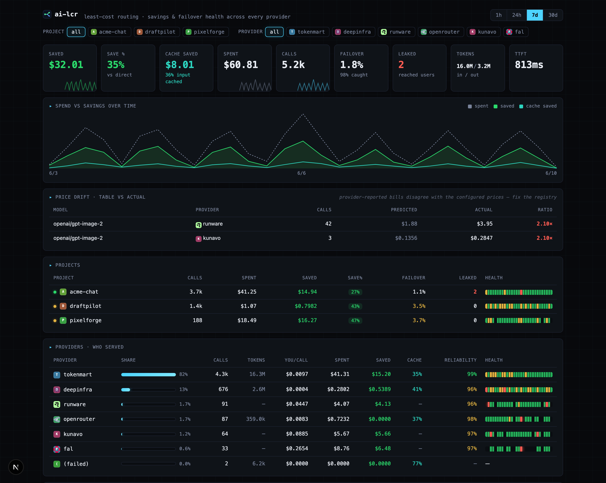

# ai-lcr-dashboard

A **self-hostable** dashboard for [ai-lcr](https://github.com/ai-lcr/ai-lcr) — see your LLM requests, **how much least-cost routing saved you**, and **whether your failovers are actually working**, across every provider you route to.

You run your own instance, so the data never leaves your infrastructure, and it's **open by default** — point an app at the URL and go, like Plausible. No login, no key required. The records carry **metadata only** (no prompts, no responses). Want it locked down? Set an optional key/password (see below) — security is opt-in, not in your way.

> Why this and not a generic LLM observability tool? Generic tools log calls. This one is built around the two things ai-lcr is for: **savings vs baseline** and **failover health** — the cross-provider view no single provider's dashboard can give you.

<p align="center">
  
</p>

*(Demo data — seed your own local copy with `createdb lcr_demo && DATABASE_URL=postgres://localhost/lcr_demo PGSSLMODE=disable node scripts/demo-seed.mjs`, then point `npm run dev` at it.)*

## What it shows

- **The stat row answers "is this working?" in one glance** — saved $ (and save % vs going direct), prompt-cache savings (shown apart — that's the provider's win, not routing's), spend, failover rate with how many were caught, and **Leaked** (the only number that means a user saw an error — it's the one that turns red).
- **Saved vs spent over time**, with cache savings as its own series.
- **Price drift** — appears only when providers' actual bills disagree with your configured price table by >±20%. A ~100× ratio is the classic USD-vs-cents slip. Cheapest-first routing is only as good as its price table; this is the smoke alarm.
- **Projects** — one row per app you tagged, each with a health strip over time.
- **Providers · who served** — share, cost/call, cache hit-rate, reliability (every attempt counts, including the ones routing failed over *away* from), and a health strip.
- **Models · what ran** — sorted by **spend** (the "what's costing me" axis), with image/video chips and per-unit economics ($/second of video, $/image) from measured usage. Long lists cap at ~12 visible rows and scroll.
- **Failover events** — the live feed of every rescue: which provider died, with what error, and who caught it.

## Deploy

It's a small Next.js + Postgres app — deploy anywhere Next runs. Vercel is one click:

[](https://vercel.com/new/clone?repository-url=https://github.com/ai-lcr/ai-lcr-dashboard&env=DATABASE_URL)

1. **Create the project** — click the button above (or import the repo in Vercel, or `npm run build && npm start` on any host).
2. **Add a Postgres → `DATABASE_URL` gets set.** In your new Vercel project: **Storage → Create Database → Neon** ([Neon Postgres on the Vercel Marketplace](https://vercel.com/marketplace/neon)). Vercel injects `DATABASE_URL` for you — nothing to copy-paste. Neon's free tier (scale-to-zero, auto-wakes on connect) is plenty for a dashboard. Any other Postgres works too ([Supabase](https://supabase.com), RDS, your own) — just set `DATABASE_URL` yourself.
3. **That's it — the table auto-creates** on the first request (ingest or page load). No migration step, no auth to configure.
4. **Point your apps at it** (next section).

**Optional hardening** (off unless you set them — leave them unset for the open, Plausible-style default):
- `INGEST_KEY` — if set, `POST /api/ingest` requires `Authorization: Bearer <key>` (locks who can write).
- `DASHBOARD_PASSWORD` — if set, viewing the dashboard requires HTTP Basic auth (locks who can read).

> **Local dev:** `cp .env.example .env.local`, set `DATABASE_URL`, `npm run dev`. (`npm run db:init` creates the table eagerly if you want; otherwise it's created on first use.)

## Send it data

From each app, wire ai-lcr's `onCall` to this dashboard with the built-in sink:

```ts
import { createLCR, createHttpSink } from "ai-lcr";
import { after } from "next/server"; // serverless: don't block the response

const lcr = createLCR({
  models: { /* … */ },
  onCall: createHttpSink({
    url: `${process.env.LCR_INGEST_URL}/api/ingest`,   // this dashboard's origin — the only thing you need
    project: process.env.LCR_PROJECT,                  // tag per app → one row per project in the fleet view
    dispatch: after,
    // headers: { authorization: `Bearer ${process.env.LCR_INGEST_KEY}` }, // only if you set INGEST_KEY
  }),
});
```

The only required env per app is `LCR_INGEST_URL` (this deploy's URL); `LCR_PROJECT` names the row. Add `LCR_INGEST_KEY` + the `headers` line **only if** you set `INGEST_KEY` on the dashboard. Open the dashboard and the project shows up.

## Environment

| Var | Required | What |
|-----|----------|------|
| `DATABASE_URL` | yes | Any Postgres (Neon, Supabase, RDS, your own). |
| `INGEST_KEY` | no | **Write door.** If set, `POST /api/ingest` requires `Authorization: Bearer <key>`. A leaked write key can write rows, not read them. |
| `DASHBOARD_PASSWORD` | no | **Read door.** If set, viewing the dashboard requires HTTP Basic auth (any username, this password). Leave empty for an open single-user box. |

## How it's wired

```
your app ──onCall(CallRecord)──▶ createHttpSink ──POST──▶ /api/ingest ──▶ Postgres ──▶ /
                                  (fire-and-forget)        (write door)    lcr_calls    (read door)
```

- **Idempotent ingest:** rows keyed by `CallRecord.id`, so fire-and-forget retries don't duplicate.
- **Within one instance, `project` is a filter, not a security boundary** — the box is yours. Multi-user isolation only matters if you turn this into a shared service; this repo deliberately doesn't.

## License

MIT
